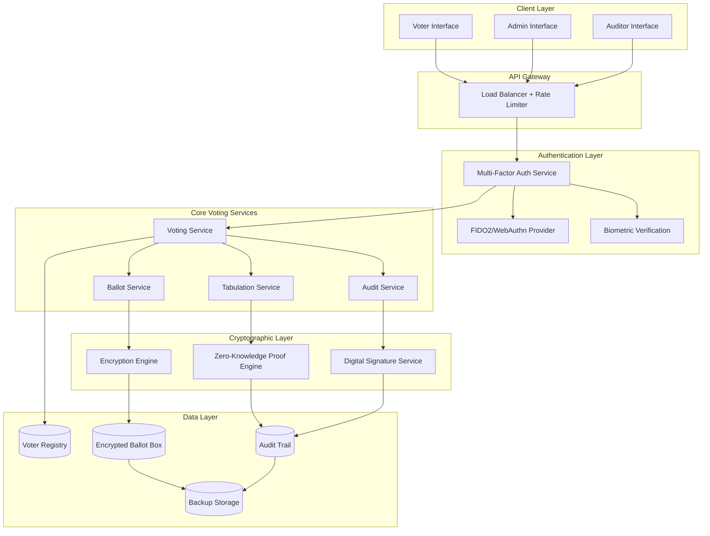

# Design Document: Secure Digital Voting System

## Overview

The Secure Digital Voting System implements an End-to-End Verifiable (E2E-V) voting platform that ensures ballot integrity, voter privacy, and result auditability through advanced cryptographic techniques. The system combines homomorphic encryption, zero-knowledge proofs, and multi-factor authentication to create a tamper-proof, transparent, and accessible voting experience.

The architecture follows a distributed, defense-in-depth approach with cryptographic verification at every stage of the voting process. Unlike blockchain-based solutions that introduce unnecessary complexity and attack vectors, this design uses proven cryptographic protocols specifically designed for secure voting systems.

## Architecture

### High-Level Architecture



### Security Architecture

The system implements multiple security layers:

1. **Network Security**: TLS 1.3 encryption, certificate pinning, and DDoS protection
2. **Authentication Security**: FIDO2/WebAuthn with biometric verification
3. **Application Security**: Input validation, rate limiting, and secure coding practices
4. **Cryptographic Security**: End-to-end encryption with homomorphic properties
5. **Data Security**: Encrypted storage, secure key management, and air-gapped backups

## Components and Interfaces

### Authentication Service

**Purpose**: Provides secure, multi-factor authentication for all system users.

**Key Features**:
- FIDO2/WebAuthn implementation for phishing-resistant authentication
- Biometric verification using secure enclaves
- Voter eligibility verification against registration database
- Session management with cryptographic tokens

**Interfaces**:
```typescript
interface AuthenticationService {
  authenticateVoter(credentials: VoterCredentials): Promise<AuthResult>
  verifyEligibility(voterId: string, electionId: string): Promise<boolean>
  generateSession(authResult: AuthResult): Promise<SecureSession>
  validateSession(sessionToken: string): Promise<SessionInfo>
}

interface VoterCredentials {
  primaryAuth: FIDOCredential | BiometricData
  secondaryAuth: SMSCode | EmailCode | BackupCode
  voterRegistrationId: string
}
```

### Encryption Engine

**Purpose**: Handles all cryptographic operations including homomorphic encryption and key management.

**Key Features**:
- Paillier homomorphic encryption for vote tallying
- ElGamal encryption for vote privacy
- Secure key generation and distribution
- Cryptographic receipt generation

**Interfaces**:
```typescript
interface EncryptionEngine {
  encryptVote(vote: PlaintextVote, publicKey: PublicKey): Promise<EncryptedVote>
  generateReceipt(encryptedVote: EncryptedVote): Promise<VoterReceipt>
  homomorphicAdd(votes: EncryptedVote[]): Promise<EncryptedTally>
  generateKeyPair(): Promise<KeyPair>
}

interface EncryptedVote {
  ciphertext: string
  proof: ZeroKnowledgeProof
  timestamp: number
  electionId: string
}
```

### Zero-Knowledge Proof Engine

**Purpose**: Generates and verifies cryptographic proofs for vote validity without revealing vote content.

**Key Features**:
- Schnorr protocol implementation for discrete logarithm proofs
- Range proofs for vote validation
- Proof aggregation for efficient verification
- Non-interactive proof generation

**Interfaces**:
```typescript
interface ZKProofEngine {
  generateValidityProof(vote: EncryptedVote): Promise<ValidityProof>
  verifyValidityProof(proof: ValidityProof): Promise<boolean>
  generateTallyProof(tally: EncryptedTally): Promise<TallyProof>
  aggregateProofs(proofs: ValidityProof[]): Promise<AggregatedProof>
}
```

### Ballot Service

**Purpose**: Manages ballot creation, distribution, and validation.

**Key Features**:
- Dynamic ballot generation based on election configuration
- Ballot integrity verification
- Vote validation against ballot structure
- Ballot versioning and updates

**Interfaces**:
```typescript
interface BallotService {
  generateBallot(electionId: string, voterId: string): Promise<SignedBallot>
  validateVote(vote: Vote, ballot: SignedBallet): Promise<ValidationResult>
  getBallotStructure(electionId: string): Promise<BallotStructure>
}

interface SignedBallot {
  ballot: BallotStructure
  signature: DigitalSignature
  timestamp: number
  voterEligibilityProof: EligibilityProof
}
```

### Tabulation Service

**Purpose**: Performs secure vote counting using homomorphic encryption.

**Key Features**:
- Homomorphic vote aggregation
- Partial decryption with threshold cryptography
- Result verification and proof generation
- Real-time tally updates (encrypted)

**Interfaces**:
```typescript
interface TabulationService {
  addVoteToTally(encryptedVote: EncryptedVote): Promise<void>
  computePartialTally(electionId: string): Promise<EncryptedTally>
  finalizeResults(electionId: string, decryptionKeys: ThresholdKey[]): Promise<ElectionResults>
  generateResultProof(results: ElectionResults): Promise<ResultProof>
}
```

### Audit Service

**Purpose**: Maintains comprehensive audit trails and enables result verification.

**Key Features**:
- Immutable audit logging with Merkle trees
- Public bulletin board for transparency
- Independent result verification
- Cryptographic timestamping

**Interfaces**:
```typescript
interface AuditService {
  logEvent(event: AuditEvent): Promise<void>
  publishToBoard(data: PublicData): Promise<void>
  verifyElectionIntegrity(electionId: string): Promise<IntegrityReport>
  generateAuditReport(electionId: string): Promise<AuditReport>
}
```

## Data Models

### Core Entities

```typescript
interface Election {
  id: string
  name: string
  description: string
  startTime: Date
  endTime: Date
  ballotStructure: BallotStructure
  publicKey: PublicKey
  status: ElectionStatus
}

interface BallotStructure {
  contests: Contest[]
  instructions: string
  version: number
  signature: DigitalSignature
}

interface Contest {
  id: string
  title: string
  description: string
  candidates: Candidate[]
  maxSelections: number
  contestType: ContestType
}

interface Vote {
  electionId: string
  contestSelections: ContestSelection[]
  timestamp: Date
  ballotVersion: number
}

interface EncryptedVoteRecord {
  id: string
  encryptedVote: EncryptedVote
  validityProof: ValidityProof
  receipt: VoterReceipt
  auditHash: string
}

interface VoterReceipt {
  receiptId: string
  electionId: string
  timestamp: Date
  verificationCode: string
  cryptographicProof: string
}
```

### Security Models

```typescript
interface SecureSession {
  sessionId: string
  voterId: string
  electionId: string
  authLevel: AuthenticationLevel
  expiresAt: Date
  cryptographicToken: string
}

interface AuditEvent {
  eventId: string
  timestamp: Date
  eventType: AuditEventType
  actorId: string
  resourceId: string
  details: Record<string, any>
  cryptographicHash: string
  previousEventHash: string
}

interface KeyPair {
  publicKey: PublicKey
  privateKeyShares: PrivateKeyShare[]
  threshold: number
  keyId: string
}
```

## Correctness Properties

*A property is a characteristic or behavior that should hold true across all valid executions of a system—essentially, a formal statement about what the system should do. Properties serve as the bridge between human-readable specifications and machine-verifiable correctness guarantees.*

The following properties ensure the correctness and security of the voting system through property-based testing:

### Authentication and Authorization Properties

**Property 1: Multi-factor authentication enforcement**
*For any* authentication attempt, the system should require at least two verification methods and reject single-factor attempts
**Validates: Requirements 1.5**

**Property 2: Credential validation consistency**
*For any* set of voter credentials, the authentication service should consistently validate them against the voter registration database and return the same result for identical inputs
**Validates: Requirements 1.1, 1.2**

**Property 3: Duplicate vote prevention**
*For any* voter who has already cast a ballot in an election, subsequent voting attempts should be rejected while preserving the original vote
**Validates: Requirements 1.3**

**Property 4: Authentication failure logging without information disclosure**
*For any* failed authentication attempt, the system should log the attempt with sufficient detail for security analysis while providing only generic error messages to the user
**Validates: Requirements 1.4**

### Ballot Integrity and Encryption Properties

**Property 5: Ballot cryptographic signing**
*For any* ballot presented to a voter, it should contain a valid cryptographic signature that can be independently verified
**Validates: Requirements 2.1**

**Property 6: Vote validation against ballot structure**
*For any* vote submission, all selections should be validated against the corresponding ballot structure constraints before acceptance
**Validates: Requirements 2.2**

**Property 7: End-to-end vote encryption with privacy separation**
*For any* cast vote, it should be encrypted before storage with complete separation between voter identity and vote content such that no linkage exists in stored data
**Validates: Requirements 2.3, 3.1, 3.2**

**Property 8: Unique receipt generation with verification capability**
*For any* cast vote, the system should generate a unique receipt that enables vote verification without revealing vote content
**Validates: Requirements 2.4**

**Property 9: Tamper detection and response**
*For any* detected tampering attempt during vote casting, the system should reject the ballot and trigger administrator alerts
**Validates: Requirements 2.5**

### Privacy and Zero-Knowledge Properties

**Property 10: Zero-knowledge vote verification**
*For any* vote verification request, the system should provide cryptographic proof of vote validity without revealing the vote content
**Validates: Requirements 3.3**

**Property 11: Privacy-preserving vote aggregation**
*For any* vote tabulation process, the aggregation should produce correct results without exposing individual voting patterns
**Validates: Requirements 3.4**

**Property 12: Administrator access restriction**
*For any* administrator interface operation, individual vote contents should remain inaccessible while maintaining system management capabilities
**Validates: Requirements 3.5**

### Auditability and Transparency Properties

**Property 13: Comprehensive cryptographic audit trail**
*For any* system operation, it should be recorded in the audit trail with cryptographic timestamps, digital signatures, and hash chain integrity
**Validates: Requirements 4.1, 7.3**

**Property 14: Verifiable vote counting with cryptographic proofs**
*For any* tabulation operation, the system should generate cryptographic proofs that enable independent verification of correct vote counting
**Validates: Requirements 4.2**

**Property 15: Public verifiability without privacy compromise**
*For any* election result, the published cryptographic data should enable independent verification while maintaining vote privacy
**Validates: Requirements 4.3, 4.5**

**Property 16: Privacy-preserving audit evidence**
*For any* audit request, the system should provide complete verifiable evidence without compromising individual vote privacy
**Validates: Requirements 4.4**

### Security and Attack Resistance Properties

**Property 17: Rate limiting for DoS protection**
*For any* sequence of authentication requests exceeding defined thresholds, the system should enforce rate limiting to prevent denial-of-service attacks
**Validates: Requirements 5.1**

**Property 18: Anomaly detection with multi-channel alerting**
*For any* detected suspicious activity pattern, the system should automatically trigger security protocols and send alerts through multiple administrator channels
**Validates: Requirements 5.2, 7.2**

**Property 19: Secure communication protocol enforcement**
*For any* data transmission, the system should use TLS 1.3 or higher with proper certificate validation
**Validates: Requirements 5.3**

**Property 20: Input validation and injection prevention**
*For any* user input, the system should validate and sanitize it to prevent injection attacks while preserving legitimate functionality
**Validates: Requirements 5.4**

**Property 21: Mutual authentication for inter-component communication**
*For any* communication between system components, both parties should be mutually authenticated with message integrity verification
**Validates: Requirements 5.6**

### Accessibility Properties

**Property 22: Assistive technology compatibility with security preservation**
*For any* accessibility feature usage (screen readers, keyboard navigation, voice input), the system should maintain full functionality while preserving all security and privacy standards
**Validates: Requirements 6.1, 6.4, 6.5**

**Property 23: Multi-language and visual accessibility support**
*For any* configured language or visual accessibility option (text size, contrast), the system should display content correctly without functional degradation
**Validates: Requirements 6.2, 6.3**

### Monitoring and Incident Response Properties

**Property 24: Real-time monitoring accuracy**
*For any* system health metric or voting activity, the monitoring dashboard should display accurate real-time information with minimal latency
**Validates: Requirements 7.1**

**Property 25: Incident response tool functionality**
*For any* simulated system incident, the response tools should enable rapid recovery with documented procedures and minimal data loss
**Validates: Requirements 7.4**

**Property 26: Automated reporting accuracy**
*For any* generated system performance or security report, it should contain accurate information reflecting actual system state and activity
**Validates: Requirements 7.5**

### Backup and Recovery Properties

**Property 27: Comprehensive encrypted backup creation**
*For any* backup operation, all election data should be included, properly encrypted, and verifiable for integrity
**Validates: Requirements 8.1, 8.4**

**Property 28: Disaster recovery with minimal data loss**
*For any* system failure scenario, the recovery process should restore functionality with data loss not exceeding defined recovery point objectives
**Validates: Requirements 8.3**

**Property 29: Backup retention policy compliance**
*For any* backup created, it should be retained according to configured legal requirements and automatically purged when retention periods expire
**Validates: Requirements 8.5**

## Error Handling

### Authentication Errors
- **Invalid Credentials**: Return generic error messages while logging specific failure reasons
- **Session Expiration**: Gracefully redirect to re-authentication without data loss
- **Rate Limiting**: Implement exponential backoff with clear user messaging
- **Biometric Failures**: Provide fallback authentication methods

### Voting Process Errors
- **Ballot Tampering**: Immediately reject ballot and alert administrators
- **Network Interruptions**: Maintain vote state and enable resumption
- **Encryption Failures**: Fail securely without exposing vote content
- **Invalid Selections**: Provide clear validation messages and correction guidance

### System Errors
- **Component Failures**: Implement graceful degradation with monitoring alerts
- **Database Errors**: Maintain data consistency with transaction rollbacks
- **Cryptographic Errors**: Fail securely and trigger security incident protocols
- **Backup Failures**: Alert administrators and attempt alternative backup methods

### Recovery Procedures
- **Partial System Failure**: Isolate failed components while maintaining core functionality
- **Complete System Failure**: Execute disaster recovery with encrypted backup restoration
- **Data Corruption**: Verify backup integrity and restore from last known good state
- **Security Incidents**: Implement incident response plan with forensic preservation

## Testing Strategy

### Dual Testing Approach

The system requires both unit testing and property-based testing for comprehensive coverage:

**Unit Tests**: Focus on specific examples, edge cases, and integration points
- Authentication flow with various credential combinations
- Ballot validation with malformed inputs
- Error handling scenarios and recovery procedures
- API endpoint security and input validation
- Cryptographic function correctness with known test vectors

**Property-Based Tests**: Verify universal properties across all inputs
- Generate random voter credentials and verify authentication consistency
- Create random ballot structures and validate vote processing
- Test encryption/decryption round-trip properties with random votes
- Verify audit trail integrity with random operation sequences
- Validate privacy preservation across random vote patterns

### Property-Based Testing Configuration

**Testing Framework**: Use Hypothesis (Python), fast-check (TypeScript), or QuickCheck (Haskell)
**Minimum Iterations**: 100 iterations per property test due to cryptographic randomization
**Test Tagging**: Each property test must reference its design document property

**Tag Format**: `Feature: secure-digital-voting, Property {number}: {property_text}`

**Example Property Test Structure**:
```python
@given(voter_credentials=voter_credential_strategy())
def test_authentication_consistency(voter_credentials):
    """Feature: secure-digital-voting, Property 2: Credential validation consistency"""
    result1 = auth_service.authenticate(voter_credentials)
    result2 = auth_service.authenticate(voter_credentials)
    assert result1.success == result2.success
    assert result1.voter_id == result2.voter_id
```

### Security Testing Requirements

**Penetration Testing**: Regular security assessments of all system components
**Cryptographic Validation**: Formal verification of cryptographic implementations
**Load Testing**: Verify system performance under election-day traffic loads
**Accessibility Testing**: Validate assistive technology compatibility
**Compliance Testing**: Ensure adherence to election security standards

### Test Environment Requirements

**Isolated Networks**: Test environments must be isolated from production systems
**Synthetic Data**: Use realistic but synthetic voter and election data
**Cryptographic Keys**: Generate separate key pairs for testing environments
**Audit Verification**: Test audit trail integrity and verification procedures
**Backup Testing**: Regularly test backup and recovery procedures